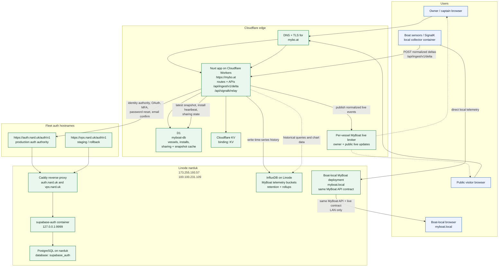

# MyBoat Architecture

Last updated: 2026-03-28

This document captures the real MyBoat deployment topology after the move to
the shared Narduk auth authority, plus the telemetry architecture the app now
targets across cloud and local boat deployments.

## Topology

## What Is Live Today

- `https://mybo.at` is the shipped MyBoat app on Cloudflare Workers.
- The Worker has the `myboat-db` D1 binding and a `KV` namespace binding.
- The app already exposes:
  - dashboard and public profile routes
  - `POST /api/ingest/v1/delta`
- Auth is no longer app-local only. The app is configured to use the external
  Supabase-compatible authority when `AUTH_AUTHORITY_URL` and the Supabase keys
  are present.
- The production auth authority is `https://auth.nard.uk/auth/v1`.
- The staging and rollback auth authority is `https://vps.nard.uk/auth/v1`.
- Both auth hostnames route through Caddy on the Linode host `narduk`.
- The auth service itself is the `supabase-auth` container listening on
  `127.0.0.1:9999`.
- Auth data lives in the dedicated PostgreSQL database `supabase_auth` on
  `narduk`.
- MyBoat still keeps its own first-party app session and app-owned vessel data;
  the external auth service is the identity authority, not the app database.

## Telemetry Responsibilities

- The collector is the only supported ingest source for cloud MyBoat.
- D1 is the operational store for:
  - users, vessels, and installations
  - sharing controls
  - ingest keys
  - installation heartbeat
  - latest vessel snapshot and other app-facing derived state
- InfluxDB is the historical telemetry store for all boats.
- The live broker is the browser-facing live source for owner and public views.
- Browsers do not connect to raw SignalK or raw InfluxDB endpoints.

## Browser Data Flow

Remote browser flow:

1. Boat collector reads local telemetry.
2. Collector posts normalized deltas to `POST /api/ingest/v1/delta`.
3. MyBoat updates D1 with latest vessel snapshot and installation heartbeat.
4. MyBoat writes telemetry history to InfluxDB.
5. MyBoat publishes normalized live events to a per-vessel live broker.
6. Browser loads initial state from MyBoat REST APIs.
7. Browser subscribes to a MyBoat live route for incremental updates.

Local boat flow:

1. The boat runs a local MyBoat deployment on `myboat.local` or a similar LAN hostname.
2. That local deployment reads onboard telemetry directly.
3. Boat-local browsers read only MyBoat-shaped APIs and live updates from the local deployment.
4. The browser contract stays the same; only the serving origin changes.

## Service Placement

- `mybo.at`
  - Cloudflare custom domain for the MyBoat app
  - serves the Nuxt Worker and all app APIs
  - owns remote owner/public reads and remote live fanout
- `auth.nard.uk`
  - production fleet auth authority
  - exposed by Caddy on `narduk`
- `vps.nard.uk`
  - staging and rollback auth hostname
  - exposed by the same Caddy host
- `narduk`
  - Linode host
  - public IP `173.255.193.57`
  - tailscale IP `100.100.231.109`
  - currently hosts Caddy, `supabase-auth`, PostgreSQL, and InfluxDB

## Source Of Truth

- MyBoat app bindings and routes:
  - [apps/web/wrangler.json](/Users/narduk/new-code/template-apps/myboat/apps/web/wrangler.json)
  - [apps/web/nuxt.config.ts](/Users/narduk/new-code/template-apps/myboat/apps/web/nuxt.config.ts)
  - [apps/web/server/utils/app-auth.ts](/Users/narduk/new-code/template-apps/myboat/apps/web/server/utils/app-auth.ts)
- Narduk auth and Linode host topology:
  - [/Users/narduk/new-code/narduk-infrastructure/docs/supabase-auth.md](/Users/narduk/new-code/narduk-infrastructure/docs/supabase-auth.md)
  - [/Users/narduk/new-code/narduk-infrastructure/docs/current-state.md](/Users/narduk/new-code/narduk-infrastructure/docs/current-state.md)
  - [/Users/narduk/new-code/narduk-infrastructure/deploy/caddy/sites/auth.nard.uk.caddy](/Users/narduk/new-code/narduk-infrastructure/deploy/caddy/sites/auth.nard.uk.caddy)
  - [/Users/narduk/new-code/narduk-infrastructure/deploy/caddy/sites/vps.nard.uk.caddy](/Users/narduk/new-code/narduk-infrastructure/deploy/caddy/sites/vps.nard.uk.caddy)
