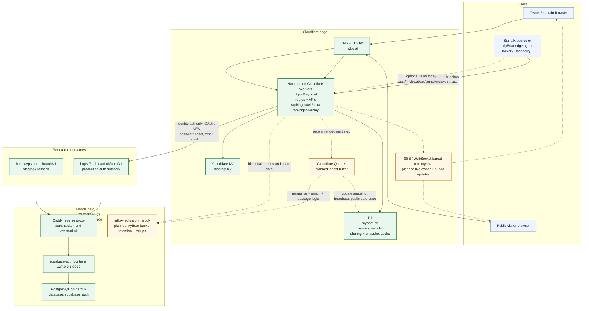

# MyBoat Architecture

Last updated: 2026-03-27

This document captures the real MyBoat deployment topology after the move to
the shared Narduk auth authority, plus the recommended next telemetry slice
using concrete services and hosts that already exist in the stack.

## Topology

## What Is Live Today

- `https://mybo.at` is the shipped MyBoat app on Cloudflare Workers.
- The Worker has the `myboat-db` D1 binding and a `KV` namespace binding.
- The app already exposes:
  - dashboard and public profile routes
  - `POST /api/ingest/v1/delta`
  - `wss://mybo.at/api/signalk/relay`
- Auth is no longer app-local only. The app is configured to use the external
  Supabase-compatible authority when `AUTH_AUTHORITY_URL` and the Supabase keys
  are present.
- The production auth authority is `https://auth.nard.uk/auth/v1`.
- The staging and rollback auth authority is `https://vps.nard.uk/auth/v1`.
- Both auth hostnames route through Caddy on the Linode host `narduk`.
- The auth service itself is the `supabase-auth` container listening on
  `127.0.0.1:9999`.
- Auth data lives in the dedicated PostgreSQL database `supabase_auth` on
  `narduk`.
- MyBoat still keeps its own first-party app session and app-owned vessel data;
  the external auth service is the identity authority, not the app database.

## Recommended Next Telemetry Slice

- Keep D1 as the operational store for users, vessels, installations, sharing
  controls, API key mappings, latest vessel snapshot, and derived public-safe
  state.
- Put durable telemetry history in Influx, using the existing
  `influx-replica` service already present on `narduk`.
- Insert Cloudflare Queues between `/api/ingest/v1/delta` and downstream
  processing so the Worker does not do full telemetry normalization inline.
- Have the queue consumer:
  - write raw or normalized timeseries into an isolated MyBoat bucket in Influx
  - update `vessel_live_snapshots` and installation heartbeat state in D1
  - emit public-safe and owner-safe live updates for SSE or WebSocket fanout
- Keep browsers off raw SignalK and raw Influx endpoints. The app should remain
  the only public read surface for dashboard, public profile, and live updates.

## Service Placement

- `mybo.at`
  - Cloudflare custom domain for the MyBoat app
  - serves the Nuxt Worker and all app APIs
- `auth.nard.uk`
  - production fleet auth authority
  - exposed by Caddy on `narduk`
- `vps.nard.uk`
  - staging and rollback auth hostname
  - exposed by the same Caddy host
- `narduk`
  - Linode host
  - public IP `173.255.193.57`
  - tailscale IP `100.100.231.109`
  - currently hosts Caddy, `supabase-auth`, PostgreSQL, and `influx-replica`

## Source Of Truth

- MyBoat app bindings and routes:
  - [apps/web/wrangler.json](/Users/narduk/new-code/template-apps/myboat/apps/web/wrangler.json)
  - [apps/web/nuxt.config.ts](/Users/narduk/new-code/template-apps/myboat/apps/web/nuxt.config.ts)
  - [apps/web/server/utils/app-auth.ts](/Users/narduk/new-code/template-apps/myboat/apps/web/server/utils/app-auth.ts)
- Narduk auth and Linode host topology:
  - [/Users/narduk/new-code/narduk-infrastructure/docs/supabase-auth.md](/Users/narduk/new-code/narduk-infrastructure/docs/supabase-auth.md)
  - [/Users/narduk/new-code/narduk-infrastructure/docs/current-state.md](/Users/narduk/new-code/narduk-infrastructure/docs/current-state.md)
  - [/Users/narduk/new-code/narduk-infrastructure/deploy/caddy/sites/auth.nard.uk.caddy](/Users/narduk/new-code/narduk-infrastructure/deploy/caddy/sites/auth.nard.uk.caddy)
  - [/Users/narduk/new-code/narduk-infrastructure/deploy/caddy/sites/vps.nard.uk.caddy](/Users/narduk/new-code/narduk-infrastructure/deploy/caddy/sites/vps.nard.uk.caddy)
