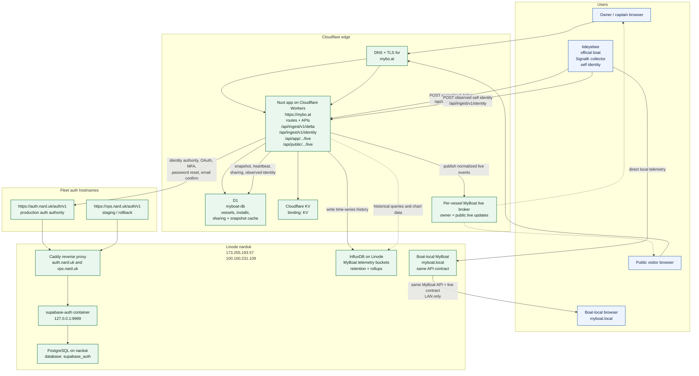

# MyBoat Architecture

Last updated: 2026-03-29

This document captures the real MyBoat deployment topology after the move to the
shared Narduk auth authority, plus the telemetry architecture the app now
targets across cloud and local boat deployments.

## Topology

## What Is Live Today

- `https://mybo.at` is the shipped MyBoat app on Cloudflare Workers.
- The Worker has the `myboat-db` D1 binding and a `KV` namespace binding.
- The app already exposes:
  - dashboard and public profile routes
  - `POST /api/ingest/v1/delta`
  - `POST /api/ingest/v1/identity`
- Auth is no longer app-local only. The app is configured to use the external
  Supabase-compatible authority when `AUTH_AUTHORITY_URL` and the Supabase keys
  are present.
- The production auth authority is `https://auth.nard.uk/auth/v1`.
- The staging and rollback auth authority is `https://vps.nard.uk/auth/v1`.
- Both auth hostnames route through Caddy on the Linode host `narduk`.
- The auth service itself is the `supabase-auth` container listening on
  `127.0.0.1:9999`.
- Auth data lives in the dedicated PostgreSQL database `supabase_auth` on
  `narduk`.
- MyBoat still keeps its own first-party app session and app-owned vessel data;
  the external auth service is the identity authority, not the app database.
- `tideyebee` is the first official real-boat MyBoat install.
- `myboat-edge-canary` on `narduk` is only a remote proving rig and is not the
  canonical deployment.
- As of 2026-03-29, the Bee install is serving SignalK on port `3000`, local
  InfluxDB `v2.7.11` on port `8086`, and SignalK reports that `2.24.0` is
  available as an update.
- As of 2026-03-29, the MyBoat cloud-history tenant is live on
  `https://influx-public.tideye.com` with MyBoat-scoped buckets and query/write
  tokens synced into the MyBoat Doppler configs.
- As of 2026-03-29, the `myboat-edge-canary` collector on `narduk` is consuming
  `wss://signalk-public.tideye.com/signalk/v1/stream?subscribe=all` and
  successfully publishing Bee-derived `core` and `detail` history into the cloud
  buckets.

## Telemetry Responsibilities

- The collector is the only supported ingest source for cloud MyBoat.
- The collector and cloud ingest both run the shared
  `@myboat/telemetry-source-policy` selector so canonical winner choice does not
  drift between the boat edge and Cloudflare.
- Selection happens after leaf expansion, so object-valued paths such as
  `navigation.position` are expanded to leaf paths before ranking, then grouped
  by `(context, canonicalPath)`.
- Sticky winners are retained by path family with freshness windows of `15s`
  for fast nav/wind/current/depth, `60s` for electrical/tanks/propulsion/
  steering, and `6h` for static identity, design, and AIS dimensions.
- D1 is the operational store for:
  - users, vessels, and installations
  - sharing controls
  - ingest keys
  - installation heartbeat
  - latest vessel snapshot
  - observed vessel identity and provenance
  - latest source inventory snapshot for the primary install
  - duplicate hotspots and tracked canonical winners per installation
  - other app-facing derived state
- InfluxDB is the historical telemetry store for all boats.
- MyBoat history writes are split into:
  - `myboat_signalk` debug raw lines in the `myboat_debug` bucket for
    short-lived troubleshooting
  - `myboat_history_core` for curated chart-safe vessel metrics
  - `myboat_history_detail` for owner-only systems telemetry
- `myboat_signalk` is the only history/debug shape that keeps high-cardinality
  source provenance tags such as `source_id`, `source_family`, and
  `publisher_role`.
- The live broker is the browser-facing live source for owner and public views.
- Browsers do not connect to raw SignalK or raw InfluxDB endpoints.
- Historical chart reads go through paired MyBoat history routes and catalog
  routes, not ad hoc client-side Flux.

## Identity Responsibilities

- The collector is responsible for speaking SignalK and discovering upstream
  self identity when available.
- Discovery may come from:
  - SignalK websocket hello / self context
  - SignalK paths carried in deltas
  - SignalK self / metadata endpoint reads for identity bootstrap and refresh
- MyBoat persists the latest observed vessel identity so UI surfaces do not need
  to infer MMSI or source metadata directly from raw live deltas.
- Captain-managed vessel profile remains separate from observed identity:
  - captain-managed fields: public name, summary, home port, sharing, overrides
  - observed fields: MMSI, observed name, callsign, dimensions, ship type,
    source context, last observed
- Dashboard and installation views should prefer observed identity for
  source-derived facts like MMSI.

## Browser Data Flow

Remote browser flow:

1. Boat collector reads local telemetry and learns the upstream self context.
2. Collector posts batched telemetry deltas to `POST /api/ingest/v1/delta`.
3. Collector posts normalized source inventory snapshots to
   `POST /api/ingest/v1/sources`.
4. Collector posts observed self identity bootstrap and refresh payloads to
   `POST /api/ingest/v1/identity`.
5. MyBoat re-runs canonical source selection as a safety gate, writes duplicate
   losers only to debug history, and updates D1 with install-level source
   diagnostics.
6. MyBoat updates D1 with latest vessel snapshot, install heartbeat, and
   observed vessel identity.
7. MyBoat records source diagnostics for the primary installation, including
   inventory snapshots, duplicate hotspots, current winners, and shadow
   publisher detection.
8. MyBoat writes curated telemetry history to InfluxDB.
9. MyBoat publishes normalized live events to a per-vessel live broker.
10. Browser loads initial state from MyBoat REST APIs.
11. Browser subscribes to a MyBoat live route for incremental updates.

Local boat flow:

1. The boat runs a local MyBoat deployment on `myboat.local` or a similar LAN
   hostname.
2. That local deployment reads onboard telemetry directly.
3. Boat-local browsers read only MyBoat-shaped APIs and live updates from the
   local deployment.
4. The browser contract stays the same; only the serving origin changes.

## History Contract

- Owner history routes:
  - `GET /api/app/vessels/[vesselSlug]/history`
  - `GET /api/app/vessels/[vesselSlug]/history/catalog`
- Public history routes:
  - `GET /api/public/[username]/[vesselSlug]/history`
  - `GET /api/public/[username]/[vesselSlug]/history/catalog`
- Request policy:
  - require `start`, `end`, and explicit `series`
  - bounded resolutions only: `auto | raw | 1m | 5m | 15m | 1h`
  - aggregate first with `aggregateWindow(...)`
  - cap per-series and track point counts
- Visibility policy:
  - public routes can read only public `core` metrics
  - owner routes can read `core` plus owner-only `detail`
- Owner diagnostics route:
  - `GET /api/app/vessels/[vesselSlug]/telemetry/sources`
  - returns latest source inventory, duplicate hotspots, current winners,
    policy version, primary-install timestamps, and `shadowPublisherSeen`
- `electrical.switches.bank.*` remains debug-only. The operator-facing switch
  surface is `electrical.switches.leopard.*`.
- Retention posture for the current POC:
  - free owner raw window target: 7 days
  - paid owner raw window target: 90 days
  - public reads stay bounded and aggregated instead of offering unlimited raw
    replay
- Production verification on 2026-03-29:
  - `GET /api/public/narduk/tideye/history/catalog` returns the public catalog
  - `GET /api/public/narduk/tideye/history?...` returns live Influx-backed track
    and chart series

## Bee Update Posture

- The Bee install is treated as production-adjacent because it is the first real
  MyBoat boat deployment.
- Any SignalK upgrade testing on Bee must run as an isolated shadow canary:
  - separate container name
  - separate state directory
  - private bind such as `127.0.0.1:3001`
  - no public cutover
  - no duplicate `signalk-to-influxdb2` writes by default
- Bee shadow canaries must identify themselves to MyBoat as
  `publisherRole=shadow`; the live primary Bee publisher remains
  `publisherRole=primary`.
- Controlled shadow publishing is opt-in only. If enabled for a test window,
  the shadow collector must target `/api/ingest/v1/delta`,
  `/api/ingest/v1/identity`, and `/api/ingest/v1/sources` with
  `MYBOAT_PUBLISHER_ROLE=shadow`, and success means diagnostics record the
  shadow publisher without displacing current primary winners.
- Before any shadow publish test window, export the official Bee source
  inventory and plugin inventory and treat that snapshot as the collision
  baseline for review.
- The operator runbook for this path lives in
  [/Users/narduk/new-code/narduk-infrastructure/docs/myboat-bee-signalk.md](/Users/narduk/new-code/narduk-infrastructure/docs/myboat-bee-signalk.md).

## Source Of Truth Split

- D1
  - captain accounts, vessels, installations
  - captain-managed vessel profile
  - observed vessel identity
  - installation heartbeat and latest vessel snapshot
  - sharing posture and app-facing derived state
- InfluxDB
  - append-oriented debug raw telemetry
  - curated `core` and `detail` history
  - historical chart reads and rollups
- Live broker
  - low-latency fanout for the latest snapshot and AIS contacts
  - ephemeral state used for browser live views

## UI Implications

- `/dashboard` MMSI should come from observed vessel identity, not manual
  onboarding-only data.
- Onboarding and settings should minimize manual entry for fields the connection
  can reliably supply.
- Installation detail should show what the collector has actually observed from
  the source, with timestamps and provenance.
- Sparse AIS deltas are normal; live handling should preserve last known
  non-null contact fields instead of resetting them to `null`.

## Service Placement

- `mybo.at`
  - Cloudflare custom domain for the MyBoat app
  - serves the Nuxt Worker and all app APIs
  - owns remote owner/public reads and remote live fanout
- `auth.nard.uk`
  - production fleet auth authority
  - exposed by Caddy on `narduk`
- `vps.nard.uk`
  - staging and rollback auth hostname
  - exposed by the same Caddy host
- `narduk`
  - Linode host
  - public IP `173.255.193.57`
  - tailscale IP `100.100.231.109`
  - currently hosts Caddy, `supabase-auth`, PostgreSQL, and InfluxDB

## Source Of Truth

- MyBoat app bindings and routes:
  - [apps/web/wrangler.json](/Users/narduk/new-code/template-apps/myboat/apps/web/wrangler.json)
  - [apps/web/nuxt.config.ts](/Users/narduk/new-code/template-apps/myboat/apps/web/nuxt.config.ts)
  - [apps/web/server/utils/app-auth.ts](/Users/narduk/new-code/template-apps/myboat/apps/web/server/utils/app-auth.ts)
  - [apps/web/server/utils/history.ts](/Users/narduk/new-code/template-apps/myboat/apps/web/server/utils/history.ts)
  - [apps/web/server/api/app/vessels/[vesselSlug]/history.get.ts](/Users/narduk/new-code/template-apps/myboat/apps/web/server/api/app/vessels/[vesselSlug]/history.get.ts)
  - [apps/web/server/api/public/[username]/[vesselSlug]/history.get.ts](/Users/narduk/new-code/template-apps/myboat/apps/web/server/api/public/[username]/[vesselSlug]/history.get.ts)
- Narduk auth and Linode host topology:
  - [/Users/narduk/new-code/narduk-infrastructure/docs/supabase-auth.md](/Users/narduk/new-code/narduk-infrastructure/docs/supabase-auth.md)
  - [/Users/narduk/new-code/narduk-infrastructure/docs/current-state.md](/Users/narduk/new-code/narduk-infrastructure/docs/current-state.md)
  - [/Users/narduk/new-code/narduk-infrastructure/docs/myboat-bee-signalk.md](/Users/narduk/new-code/narduk-infrastructure/docs/myboat-bee-signalk.md)
  - [/Users/narduk/new-code/narduk-infrastructure/deploy/caddy/sites/auth.nard.uk.caddy](/Users/narduk/new-code/narduk-infrastructure/deploy/caddy/sites/auth.nard.uk.caddy)
  - [/Users/narduk/new-code/narduk-infrastructure/deploy/caddy/sites/vps.nard.uk.caddy](/Users/narduk/new-code/narduk-infrastructure/deploy/caddy/sites/vps.nard.uk.caddy)
